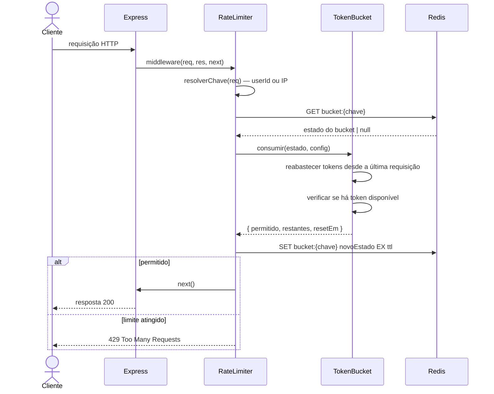

# Design: Middleware de Rate Limiting

## Visão Geral

Rate limiter com algoritmo de token bucket implementado como middleware Express,
usando Redis para estado distribuído. Os limites são configuráveis por endpoint
e aplicados por ID de usuário (autenticado) ou endereço IP (não autenticado).

## Arquitetura

### Componentes

| Componente | Responsabilidade |
|---|---|
| `rateLimiter()` | Factory do middleware Express — envolve qualquer rota com rate limiting |
| `TokenBucket` | Algoritmo central — gerencia reabastecimento e consumo de tokens |
| `RedisStore` | Backend de estado distribuído — persiste o estado do bucket entre instâncias |
| `LimitConfig` | Configuração por endpoint — capacidade, taxa de reabastecimento, janela |

### Diagrama de Sequência



## Modelos de Dados

```typescript
interface BucketState {
  tokens: number         // quantidade atual de tokens
  lastRefillAt: number   // timestamp unix em ms
}

interface LimitConfig {
  capacity: number       // máximo de tokens (teto de burst)
  refillRate: number     // tokens adicionados por segundo
  windowMs: number       // TTL do Redis para a chave do bucket
}

interface LimitResult {
  allowed: boolean
  remaining: number
  resetAt: number        // timestamp unix em ms quando o bucket estará cheio novamente
}
```

**Algoritmo token bucket (pseudocódigo):**

```
função consumir(estado, config):
  agora = Date.now()
  decorrido = agora - estado.lastRefillAt
  reabastecido = piso(decorrido / 1000 * config.refillRate)
  tokens = min(estado.tokens + reabastecido, config.capacity)

  se tokens >= 1:
    retornar { permitido: true, tokens: tokens - 1, lastRefillAt: agora }
  senão:
    retornar { permitido: false, tokens: 0, lastRefillAt: agora }
```

## Tratamento de Erros

| Cenário | Comportamento | Requisito |
|---|---|---|
| Falha na conexão com Redis | Fail-open — permite a requisição e registra aviso | 1.3 |
| Token indisponível | 429 com header `Retry-After` | 1.1 |
| Config ausente para a rota | Usa a config global padrão | 2.1 |

## Considerações Não-Funcionais

- **Latência:** GET + SET no Redis adiciona ~1ms por requisição em rede local.
  Aceitável para a meta de menos de 100ms de overhead.
- **Consistência distribuída:** Script Lua para GET + SET atômico no Redis,
  evitando condições de corrida sob carga concorrente.
- **Fail-open:** Se o Redis estiver inacessível, as requisições são liberadas
  em vez de rejeitadas — disponibilidade é priorizada sobre limitação estrita.

## Estratégia de Testes

- **Unitários:** `TokenBucket.consumir()` — cálculo de reabastecimento, teto de burst, exaustão.
- **Unitários:** `resolverChave()` — caminho autenticado vs. não autenticado.
- **Integração:** Middleware aplicado a um app Express de teste com Redis via `ioredis-mock`.
- **Carga:** Verificar overhead menor que 100ms a 1.000 req/s com `autocannon`.
