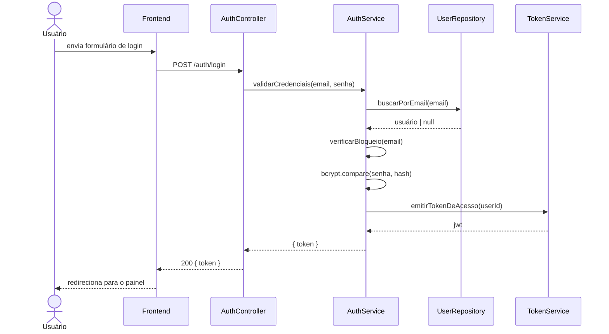

# Design: Autenticação de Usuários

## Visão Geral

Autenticação baseada em JWT com hash de senha via bcrypt. A abordagem stateless
foi escolhida para suportar escalabilidade horizontal sem necessidade de
armazenamento compartilhado de sessão. A proteção contra força bruta é tratada
na camada de aplicação com um contador de tentativas armazenado no Redis.

## Arquitetura

### Componentes

| Componente | Responsabilidade |
|---|---|
| `AuthController` | Gerencia as rotas HTTP: cadastro, login, logout, redefinição de senha |
| `AuthService` | Lógica de negócio: validação de credenciais, geração de tokens, controle de bloqueio |
| `UserRepository` | Persiste e recupera registros de usuário no banco de dados |
| `TokenService` | Emite e valida tokens JWT de acesso e tokens de redefinição |
| `MailService` | Envia e-mails transacionais (redefinição de senha) |
| `LockoutCache` | Armazenamento Redis para contagem de tentativas falhas (req. 2.2) |

### Diagrama de Sequência



## Modelos de Dados

```typescript
interface User {
  id: string           // UUID
  email: string        // único, minúsculas
  passwordHash: string // bcrypt, fator de custo 12
  createdAt: Date
  updatedAt: Date
}

interface ResetToken {
  id: string
  userId: string
  token: string        // aleatório criptograficamente, 32 bytes hex
  expiresAt: Date      // agora + 1 hora (req. 3.1)
  usedAt: Date | null  // null até ser consumido (req. 3.3)
}
```

## Tratamento de Erros

| Cenário | Comportamento | Requisito |
|---|---|---|
| E-mail duplicado no cadastro | 409 + "E-mail já cadastrado" | 1.2 |
| Formato de e-mail inválido | 422 + erro inline no campo | 1.3 |
| Senha muito curta | 422 + erro inline no campo | 1.4 |
| Credenciais inválidas no login | 401 + mensagem genérica | 2.3 |
| 5ª tentativa de login falha | 423 + mensagem de bloqueio + TTL de 15 min no Redis | 2.2 |
| E-mail não cadastrado na redefinição | 200 + mesma mensagem de cadastrado (proteção contra enumeração) | 3.2 |
| Link de redefinição expirado ou usado | 410 + "Este link expirou" | 3.3 |
| Requisição com token invalidado | 401 | 4.2 |

## Considerações Não-Funcionais

- **Segurança:** Senhas com hash bcrypt de fator 12. Tokens de redefinição são
  valores aleatórios criptograficamente seguros de 32 bytes, armazenados com
  hash no banco.
- **Proteção contra força bruta:** Contador de tentativas falhas no Redis com
  TTL de 15 minutos por e-mail (req. 2.2). Contador zerado após login bem-sucedido.
- **Validade do token:** Tokens JWT de acesso expiram em 1 hora. Estratégia de
  refresh token está fora do escopo desta spec.
- **Enumeração de contas:** O fluxo de redefinição retorna respostas idênticas
  para e-mails cadastrados e não cadastrados (req. 3.2).

## Estratégia de Testes

- **Unitários:** `AuthService` — validação de credenciais, lógica de bloqueio,
  verificação de expiração de token.
- **Integração:** Fluxo completo cadastro → login → logout contra banco de teste.
  Redefinição de senha ponta a ponta com servidor de e-mail mock.
- **E2E:** Caminho feliz de login e bloqueio por força bruta via interface.
