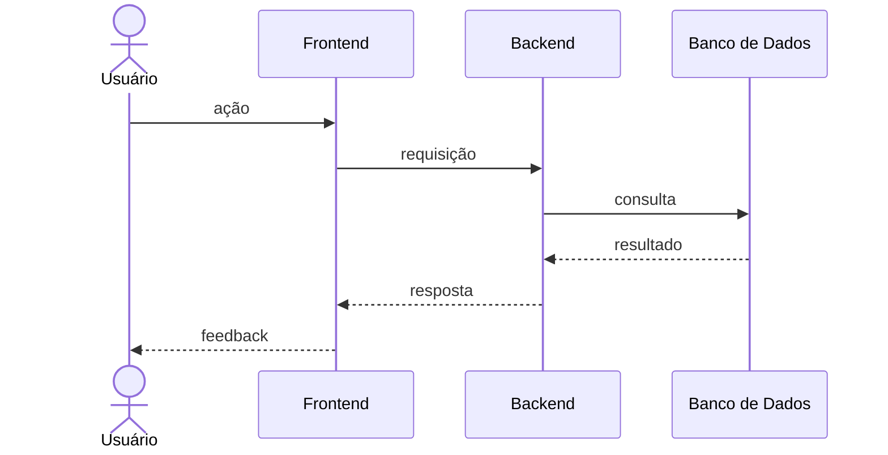

# Formatos dos Arquivos

Formato exato para cada artefato gerado. Siga estes templates à risca.

---

## requirements.md

```markdown
# Requisitos: <Nome da Feature>

## Visão Geral

<Um parágrafo descrevendo a feature e seu propósito de negócio.>

## Requisitos

### 1. <Título da História de Usuário>

**História:** Como <papel>, quero <capacidade>, para que <benefício>.

#### Critérios de Aceitação

1. QUANDO <condição>
   O SISTEMA DEVE <comportamento>

2. QUANDO <condição>
   O SISTEMA DEVE <comportamento>

3. SE <condição indesejada>
   ENTÃO O SISTEMA DEVE <comportamento>

---

### 2. <Título da História de Usuário>

**História:** Como <papel>, quero <capacidade>, para que <benefício>.

#### Critérios de Aceitação

1. QUANDO <condição>
   O SISTEMA DEVE <comportamento>

2. ENQUANTO <pré-condição>
   QUANDO <gatilho>
   O SISTEMA DEVE <comportamento>
```

**Regras:**
- Critérios são numerados por história (1.1, 1.2, 2.1, …) para rastreabilidade.
  Use o número da história como prefixo em referências cruzadas (ex.: "satisfaz 1.1").
- Toda história precisa de ao menos um critério de caminho feliz e um de erro/edge case.
- Não adicione seções extras (status, responsável, data) — mantenha limpo.

---

## design.md

```markdown
# Design: <Nome da Feature>

## Visão Geral

<Descrição de alto nível da abordagem técnica e por que foi escolhida.>

## Arquitetura

### Componentes

| Componente | Responsabilidade |
|---|---|
| <nome> | <O que faz> |
| <nome> | <O que faz> |

### Diagrama de Sequência



## Modelos de Dados

<Descreva entidades, schemas ou tipos relevantes para esta feature.>

```typescript
interface ExemploEntidade {
  id: string
  // ...
}
```

## Tratamento de Erros

| Cenário | Comportamento | Requisito |
|---|---|---|
| <Caso de erro> | <Como é tratado> | <1.3> |

## Considerações Não-Funcionais

<Performance, segurança, escalabilidade ou compliance relevantes para esta
feature. Referencie números de requisito onde aplicável.>

## Estratégia de Testes

<Abordagem de testes unitários, de integração e e2e. Quais comportamentos
são cobertos em cada camada.>
```

**Regras:**
- Toda decisão de design deve referenciar ao menos um número de requisito.
- O diagrama de sequência deve cobrir o fluxo principal do caminho feliz.
- Não invente comportamentos não cobertos pelo `requirements.md`.

---

## tasks.md

```markdown
# Tarefas: <Nome da Feature>

- [ ] 1. <Título de alto nível da tarefa>
  - <Sub-tarefa concreta>
  - <Sub-tarefa concreta>
  - **Requisitos:** 1.1, 1.2

- [ ] 2. <Título de alto nível da tarefa>
  - <Sub-tarefa concreta>
  - <Sub-tarefa concreta>
  - **Requisitos:** 2.1

- [ ] 3. <Tarefa de validação>
  - Escrever testes cobrindo os critérios de aceitação 1.1, 1.2
  - Verificar tratamento de erros para 1.3
  - **Requisitos:** 1.1, 1.2, 1.3
```

**Regras:**
- Tarefas são ordenadas por dependência — cada tarefa pode ser iniciada sem
  depender de uma não-resolvida acima dela.
- Toda tarefa referencia o(s) número(s) de requisito que satisfaz.
- Inclua ao menos uma tarefa de validação/testes por história.
- Sub-tarefas são concretas e acionáveis, não vagas ("implementar X", não "trabalhar em X").
- Não adicione campos de status, responsável ou data — o checkbox é suficiente.
