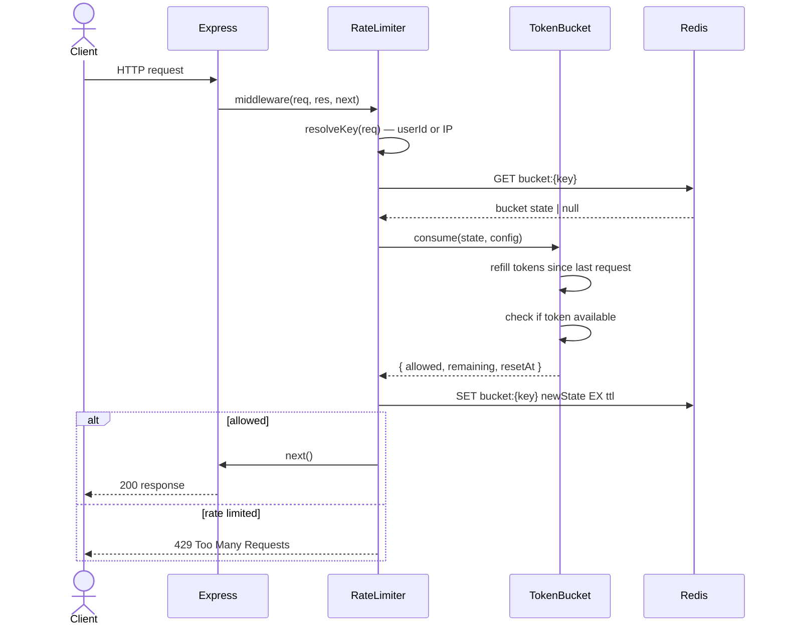

# Design: Rate Limiter Middleware

## Overview

Token bucket rate limiter implemented as Express middleware, using Redis
for distributed state. Limits are configurable per endpoint and enforced
per user ID (authenticated) or IP address (unauthenticated).

## Architecture

### Components

| Component | Responsibility |
|---|---|
| `rateLimiter()` | Express middleware factory — wraps any route with rate limiting |
| `TokenBucket` | Core algorithm — manages token replenishment and consumption |
| `RedisStore` | Distributed state backend — persists bucket state across instances |
| `LimitConfig` | Per-endpoint configuration — capacity, refill rate, window |

### Sequence Diagram



## Data Models

```typescript
interface BucketState {
  tokens: number       // current token count
  lastRefillAt: number // unix timestamp ms
}

interface LimitConfig {
  capacity: number     // max tokens (burst ceiling)
  refillRate: number   // tokens added per second
  windowMs: number     // Redis TTL for the bucket key
}

interface LimitResult {
  allowed: boolean
  remaining: number
  resetAt: number      // unix timestamp ms when bucket is full again
}
```

**Token bucket algorithm (pseudocode):**

```
function consume(state, config):
  now = Date.now()
  elapsed = now - state.lastRefillAt
  refilled = floor(elapsed / 1000 * config.refillRate)
  tokens = min(state.tokens + refilled, config.capacity)

  if tokens >= 1:
    return { allowed: true, tokens: tokens - 1, lastRefillAt: now }
  else:
    return { allowed: false, tokens: 0, lastRefillAt: now }
```

## Error Handling

| Scenario | Behavior | Requirement |
|---|---|---|
| Redis connection failure | Fail open — allow request, log warning | 1.3 |
| Token unavailable | 429 with `Retry-After` header | 1.1 |
| Missing config for route | Use global default config | 2.1 |

## Non-Functional Considerations

- **Latency:** Redis GET + SET adds ~1ms per request on local network.
  Acceptable for the target of <100ms overhead.
- **Distributed correctness:** Lua script used for atomic GET + SET in Redis
  to prevent race conditions under concurrent load.
- **Fail-open:** If Redis is unreachable, requests are passed through
  rather than rejected — availability is prioritised over strict limiting.

## Testing Strategy

- **Unit:** `TokenBucket.consume()` — refill math, burst ceiling, exhaustion.
- **Unit:** `resolveKey()` — authenticated vs unauthenticated path.
- **Integration:** Middleware applied to a test Express app, Redis running
  in-process via `ioredis-mock`.
- **Load:** Verify <100ms overhead under 1000 req/s using `autocannon`.
