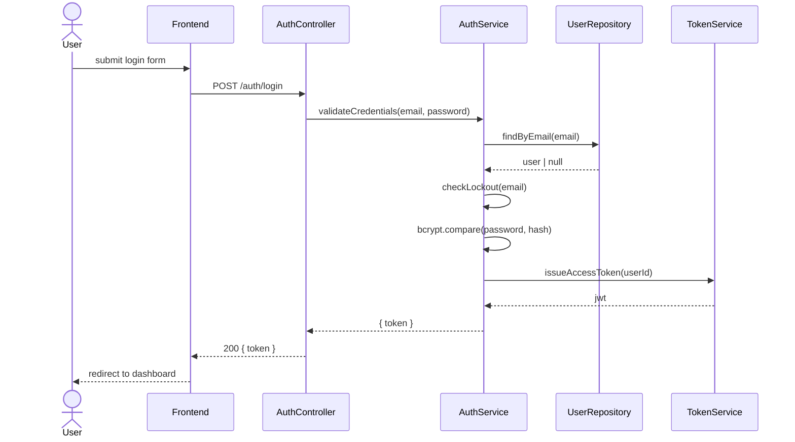

# Design: User Authentication

## Overview

JWT-based authentication with bcrypt password hashing. A stateless token
approach was chosen to support horizontal scaling without shared session
storage. Brute-force protection is handled at the application layer using
a Redis-backed attempt counter.

## Architecture

### Components

| Component | Responsibility |
|---|---|
| `AuthController` | Handles HTTP routes: register, login, logout, password reset |
| `AuthService` | Business logic: credential validation, token generation, lockout checks |
| `UserRepository` | Persists and retrieves user records from the database |
| `TokenService` | Issues and validates JWT access tokens and reset tokens |
| `MailService` | Sends transactional emails (password reset) |
| `LockoutCache` | Redis-backed store for failed attempt counts (req. 2.2) |

### Sequence Diagram



## Data Models

```typescript
interface User {
  id: string           // UUID
  email: string        // unique, lowercase
  passwordHash: string // bcrypt, cost factor 12
  createdAt: Date
  updatedAt: Date
}

interface ResetToken {
  id: string
  userId: string
  token: string        // cryptographically random, 32 bytes hex
  expiresAt: Date      // now + 1 hour (req. 3.1)
  usedAt: Date | null  // null until consumed (req. 3.3)
}
```

## Error Handling

| Scenario | Behavior | Requirement |
|---|---|---|
| Duplicate email on register | 409 + display "Email already registered" | 1.2 |
| Invalid email format | 422 + inline field error | 1.3 |
| Password too short | 422 + inline field error | 1.4 |
| Invalid login credentials | 401 + generic message | 2.3 |
| 5th failed login attempt | 423 + lockout message + 15-min Redis TTL | 2.2 |
| Unregistered email on reset | 200 + same message as registered (enumeration guard) | 3.2 |
| Expired or used reset link | 410 + "This link has expired" message | 3.3 |
| Request with invalidated token | 401 | 4.2 |

## Non-Functional Considerations

- **Security:** Passwords hashed with bcrypt cost factor 12. Reset tokens are
  32-byte cryptographically random values stored hashed in the DB.
- **Brute-force protection:** Failed attempt counter stored in Redis with a
  15-minute TTL per email (req. 2.2). Counter resets on successful login.
- **Token lifetime:** JWT access tokens expire in 1 hour. Refresh token
  strategy is out of scope for this spec.
- **Account enumeration:** Password reset flow returns identical responses for
  registered and unregistered emails (req. 3.2).

## Testing Strategy

- **Unit:** `AuthService` credential validation, lockout logic, token
  expiry checks.
- **Integration:** Full register → login → logout flow against a test
  database. Password reset end-to-end with a mock mail server.
- **E2E:** Happy path login and brute-force lockout via the UI.
