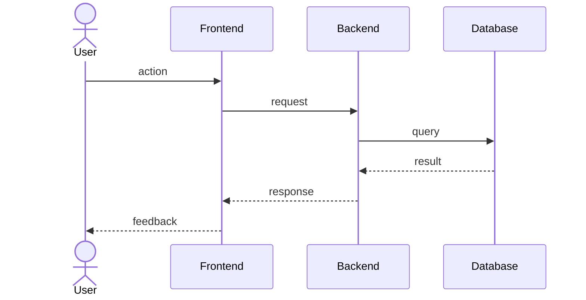

# File Formats

Exact format for each generated artifact. Follow these templates precisely.

## Canonical layout (repository override)

When the workspace contains **`docs/example/requirements.md`**, **`docs/example/design.md`**, and **`docs/example/tasks.md`**:

- **Those files define layout**, not only this document: match their **section order**, **heading levels**, and **structural patterns** (for example glossary, definition of done, numbered requirements, HTTP contract subsections).
- The templates below are the **fallback** when `docs/example/*.md` do **not** exist.
- **Do not** add or remove top-level structural sections relative to the example to "simplify" or "improve" unless the user explicitly requests a change.

## Document roles (short)

| File | Role |
| --- | --- |
| `requirements.md` | Behaviors and acceptance criteria (EARS). Links into `design.md` for concrete values. |
| `design.md` | **Normative** technical contract: one value per decision (routes, bodies, status codes, policies). |
| `tasks.md` | Sequenced work and verification; cites requirement ids + `design.md#slug`, not duplicate specs. |

## Cross-links

- Use **Markdown headings** as link targets so previews (Cursor, VS Code, GitHub) generate stable fragments.
- Avoid `<a id="...">` as the **only** anchor for a subsection.

## Normative design (no ambiguity)

In `design.md`, for anything a verifier compares to an expected outcome:

- Use **literal** HTTP status integers, **exact** JSON field names, **fixed** policies (for example DLQ after N receives).
- **Do not** use: "pick one", "either … or …", "before verification", placeholder cells like "_e.g. 200_", or "PUT or PATCH" when only one method applies.
- If a decision is unknown, **ask the user** before writing that subsection.

---

## requirements.md

```markdown
# Requirements: <Feature Name>

## Overview

<One paragraph describing the feature and its business purpose.>

## Requirements

### 1. <User Story Title>

**User Story:** As a <role>, I want <capability>, so that <benefit>.

#### Acceptance Criteria

1. WHEN <condition>
   THE SYSTEM SHALL <behavior>

2. WHEN <condition>
   THE SYSTEM SHALL <behavior>

3. IF <undesired condition>
   THEN THE SYSTEM SHALL <behavior>

---

### 2. <User Story Title>

**User Story:** As a <role>, I want <capability>, so that <benefit>.

#### Acceptance Criteria

1. WHEN <condition>
   THE SYSTEM SHALL <behavior>

2. WHILE <precondition>
   WHEN <trigger>
   THE SYSTEM SHALL <behavior>
```

**Rules:**
- Criteria are numbered per story (1.1, 1.2, 2.1, …) for traceability.
  Use the story number as prefix in cross-references (e.g. "satisfies 1.1").
- Every story needs at least one happy-path criterion and one error/edge criterion.
- When a canonical example exists, **its** extra sections (glossary, definition of done, introduction) are **allowed** and expected—match the example.
- Without an example, keep the template minimal: do not add status, owner, or date fields unless the user asks.

---

## design.md

```markdown
# Design: <Feature Name>

## Overview

<High-level description of the technical approach and why it was chosen.>

## Architecture

### Components

| Component | Responsibility |
|---|---|
| <Name> | <What it does> |
| <Name> | <What it does> |

### Sequence Diagram



## Data Models

<Describe entities, schemas, or types relevant to this feature.>

```typescript
interface ExampleEntity {
  id: string
  // ...
}
```

## Error Handling

| Scenario | Behavior | Requirement |
|---|---|---|
| <Error case> | <How it's handled> | <1.3> |

## Non-Functional Considerations

<Performance, security, scalability, or compliance notes relevant to this
feature. Reference requirement numbers where applicable.>

## Testing Strategy

<Unit, integration, and e2e approach. Which behaviors are covered at which
layer.>
```

**Rules:**
- Every design decision must reference at least one requirement number.
- The sequence diagram must cover the main happy-path flow (when the canonical example includes one).
- Do not invent behaviors not covered by `requirements.md`.
- Tables and subsections that define **HTTP**, **queues**, or **observability** are **normative**: fill them completely; see **Normative design** above.

---

## tasks.md

```markdown
# Tasks: <Feature Name>

- [ ] 1. <High-level task title>
  - <Concrete sub-task>
  - <Concrete sub-task>
  - **Requirements:** 1.1, 1.2

- [ ] 2. <High-level task title>
  - <Concrete sub-task>
  - <Concrete sub-task>
  - **Requirements:** 2.1

- [ ] 3. <Validation task>
  - Write tests covering acceptance criteria 1.1, 1.2
  - Verify error handling for 1.3
  - **Requirements:** 1.1, 1.2, 1.3
```

**Rules:**
- Tasks are ordered by dependency — each task can be started without
  blocking on an unresolved task above it.
- Every task references the requirement number(s) it satisfies.
- Include at least one validation/testing task per story.
- Sub-tasks are concrete and actionable, not vague ("implement X", not "work on X").
- **Verification** sub-bullets should point to **`design.md#…`** and requirement
  criteria for expected outcomes, instead of copying full JSON or status tables.
- Do not add status fields, owners, or dates — the checkbox is enough (unless
  the canonical example uses a definition-of-done block at the top—then match it).
