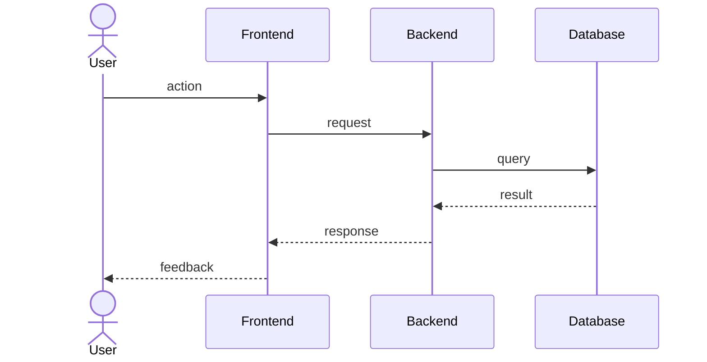

# File Formats

Exact format for each generated artifact. Follow these templates precisely.

---

## requirements.md

```markdown
# Requirements: <Feature Name>

## Overview

<One paragraph describing the feature and its business purpose.>

## Requirements

### 1. <User Story Title>

**User Story:** As a <role>, I want <capability>, so that <benefit>.

#### Acceptance Criteria

1. WHEN <condition>
   THE SYSTEM SHALL <behavior>

2. WHEN <condition>
   THE SYSTEM SHALL <behavior>

3. IF <undesired condition>
   THEN THE SYSTEM SHALL <behavior>

---

### 2. <User Story Title>

**User Story:** As a <role>, I want <capability>, so that <benefit>.

#### Acceptance Criteria

1. WHEN <condition>
   THE SYSTEM SHALL <behavior>

2. WHILE <precondition>
   WHEN <trigger>
   THE SYSTEM SHALL <behavior>
```

**Rules:**
- Criteria are numbered per story (1.1, 1.2, 2.1, …) for traceability.
  Use the story number as prefix in cross-references (e.g. "satisfies 1.1").
- Every story needs at least one happy-path criterion and one error/edge criterion.
- Do not add extra sections (status, owner, date) — keep it clean.

---

## design.md

```markdown
# Design: <Feature Name>

## Overview

<High-level description of the technical approach and why it was chosen.>

## Architecture

### Components

| Component | Responsibility |
|---|---|
| <Name> | <What it does> |
| <Name> | <What it does> |

### Sequence Diagram



## Data Models

<Describe entities, schemas, or types relevant to this feature.>

```typescript
interface ExampleEntity {
  id: string
  // ...
}
```

## Error Handling

| Scenario | Behavior | Requirement |
|---|---|---|
| <Error case> | <How it's handled> | <1.3> |

## Non-Functional Considerations

<Performance, security, scalability, or compliance notes relevant to this
feature. Reference requirement numbers where applicable.>

## Testing Strategy

<Unit, integration, and e2e approach. Which behaviors are covered at which
layer.>
```

**Rules:**
- Every design decision must reference at least one requirement number.
- The sequence diagram must cover the main happy-path flow.
- Do not invent behaviors not covered by `requirements.md`.

---

## tasks.md

```markdown
# Tasks: <Feature Name>

- [ ] 1. <High-level task title>
  - <Concrete sub-task>
  - <Concrete sub-task>
  - **Requirements:** 1.1, 1.2

- [ ] 2. <High-level task title>
  - <Concrete sub-task>
  - <Concrete sub-task>
  - **Requirements:** 2.1

- [ ] 3. <Validation task>
  - Write tests covering acceptance criteria 1.1, 1.2
  - Verify error handling for 1.3
  - **Requirements:** 1.1, 1.2, 1.3
```

**Rules:**
- Tasks are ordered by dependency — each task can be started without
  blocking on an unresolved task above it.
- Every task references the requirement number(s) it satisfies.
- Include at least one validation/testing task per story.
- Sub-tasks are concrete and actionable, not vague ("implement X", not "work on X").
- Do not add status fields, owners, or dates — the checkbox is enough.
